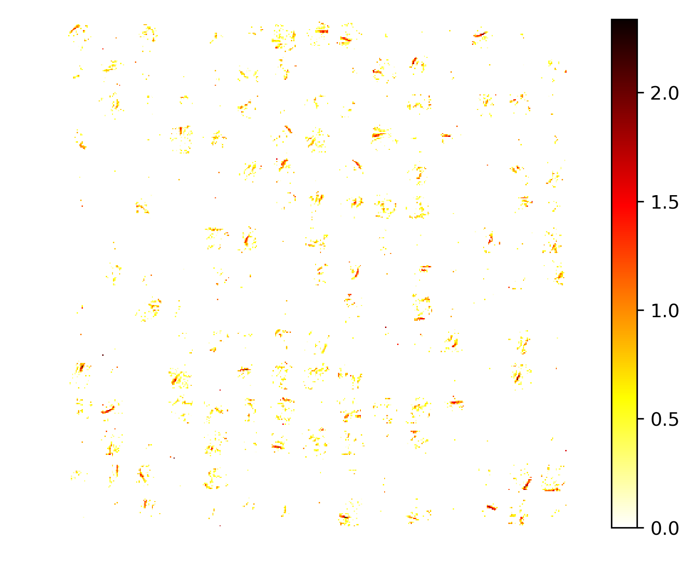

# Sparse Variational Dropout

Sparse Variational Dropout a Minimal Working Example, Variational Dropout Sparsifies Deep Neural Networks (https://arxiv.org/pdf/1701.05369.pdf).


<p align="center">

</p>
The sample of neuron weights of shape 10x10 from the first layer.

Original repo https://github.com/ars-ashuha/variational-dropout-sparsifies-dnn. 

# Citation

If you found this code useful please the original paper
```
@InProceedings{molchanov2017variational,
  title={Variational Dropout Sparsifies Deep Neural Networks},
  author={Dmitry Molchanov and Arsenii Ashukha and Dmitry Vetrov},
  booktitle={Proceedings of the 34th International Conference on Machine Learning},
  year={2017}
}
```
